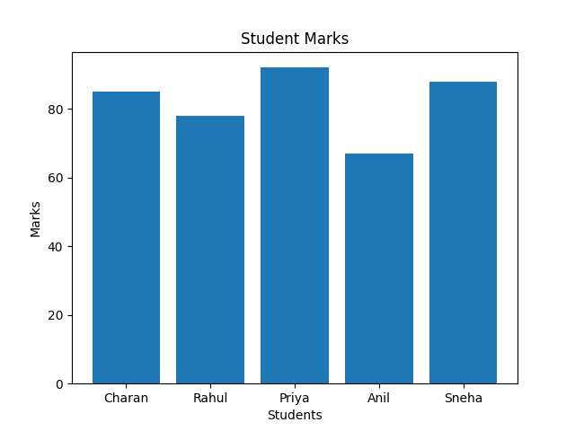
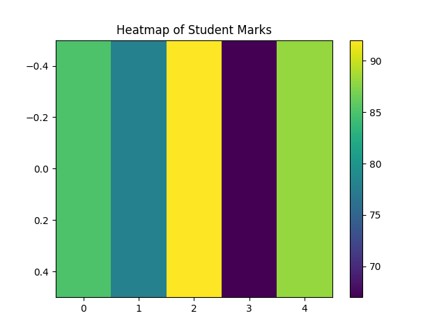
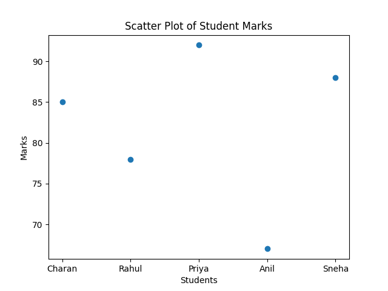

# Data Analysis Project

## Overview

This project demonstrates data analysis and visualization using Python. The dataset contains student marks, and various visualization techniques are used to identify trends, compare performance, and generate insights.

## Technologies Used

* Python
* Pandas
* NumPy
* Matplotlib

## Project Files

```text
Data-Analysis-Project/
│
├── screenshots/
│   ├── bar_chart.png
│   ├── heatmap.png
│   └── scatter_plot.png
│
├── data_analysis_matrix_tool.py
├── students.csv
├── Data_Analysis_Report.pdf
├── Data_Analysis_Report.docx
└── README.md
```

## Dataset

| Student | Marks |
| ------- | ----- |
| Charan  | 85    |
| Rahul   | 78    |
| Priya   | 92    |
| Anil    | 67    |
| Sneha   | 88    |

## Data Visualization

### Bar Chart of Student Marks



**Observation:** Priya scored the highest marks (92), while Anil scored the lowest marks (67).

---

### Heatmap of Student Marks



**Observation:** The heatmap highlights score variations and helps identify high and low performers.

---

### Scatter Plot of Student Marks



**Observation:** The scatter plot clearly shows the distribution of marks among students and highlights performance differences.

---

## Key Insights

* Priya achieved the highest score (92).
* Sneha and Charan also performed well with scores above 80.
* Rahul scored close to the class average.
* Anil scored the lowest marks among the students.
* Visualizations provide an effective way to understand performance trends.

## Results

* Successfully analyzed student performance data.
* Created multiple visualizations using Matplotlib.
* Generated meaningful insights from the dataset.
* Demonstrated data analysis and reporting techniques using Python.

## How to Run

```bash
git clone https://github.com/charanyadavkandhi/Data-Analysis-Project.git

cd Data-Analysis-Project

pip install pandas numpy matplotlib

python data_analysis_matrix_tool.py
```

## Future Improvements

* Add more datasets for analysis.
* Create interactive dashboards using Plotly or Streamlit.
* Include statistical analysis and predictive modeling.
* Enhance visualizations with additional chart types.

## Author

**Kandhi Charan Yadav**

* GitHub: https://github.com/charanyadavkandhi
* LinkedIn: https://www.linkedin.com/in/kandhicharanyadav/
